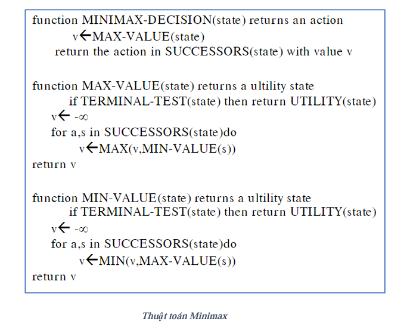
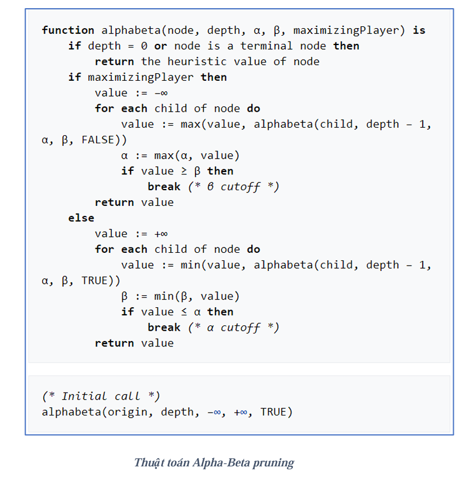
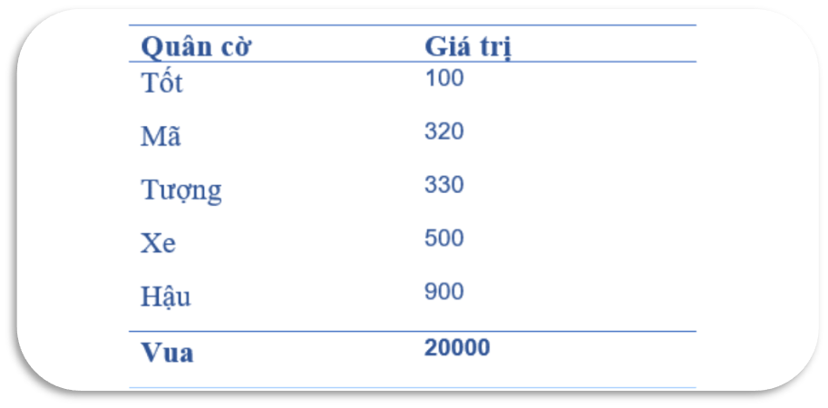
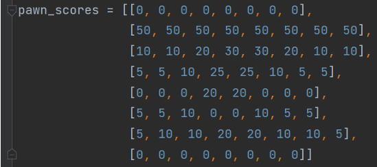
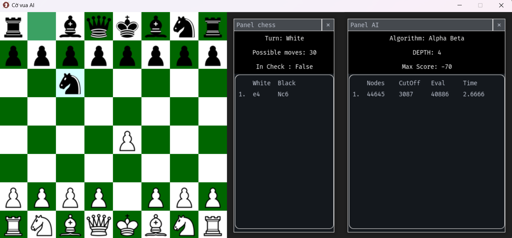

# Xây dựng Game cờ vua sử dụng trí tuệ nhân tạo

## I. Nội dung phương pháp

Các phương pháp áp dụng:

- Thuật toán tìm kiếm nước đi Alpha-beta Prunning và Minimax
- Các hàm đánh giá Heuristic

### 1. Thuật toán tìm kiếm nước đi

#### 1.1 Thuật toán Minimax

**Minimax** là giải thuật là một thuật toán đệ quy lựa chọn bước đi kế tiếp trong một trò chơi có hai người bằng cách so sánh các node trên cây trò chơi.



- **Ưu điểm:** Tìm kiếm được mọi nước đi tiếp theo sau đó lựa chọn nước đi tốt nhất.
- **Khuyết điểm:** Đối với các trò chơi có không gian trạng thái lớn như cờ vua  việc chỉ áp dụng giải thuật Minimax không còn hiệu quả nữa do sự bùng nổ tổ hợp quá lớn.

#### 1.2 Thuật toán Alpha-beta Prunning

**Alpha-beta Prunning** ra đời và dần thay thế thuật toán Minimax. Một trong số những ưu điểm đáng chú ý của nó là tinh giản được quá trình tìm nghiệm, loại trừ được một số trường hợp không thích hợp phát sinh và vẫn đảm bảo không ảnh hưởng đến kết quả sau cùng. 



### 2. Các hàm đánh giá Heuristic

Sử dụng 2 hàm đánh giá cơ bản là: **Tổng điểm từng quân cờ** và **Điểm theo vị trí của từng quân**

Vì mỗi quân cờ sẽ phát huy hết điểm mạnh dựa vào vị trí của nó trên bàn cờ. Do đó mỗi quân cờ sẽ có một ma trận điểm thưởng $8 × 8$.

Điểm từng quân cờ:


Điểm theo vị trí của quân tốt:



## II. Chạy chương trình

Yêu cầu python 3.8

```
pip install -r requirement.txt

python game.py
```

## III. Kết quả

---

1. Trò chơi có 2 chế độ:

- Người với Người
- Người với Máy


2. Các phím tắt hỗ trợ:

- Phím Z: undo lại nước đi
- Phím R: reset lại game

Và các tính năng gợi ý nước có thể, lịch sử các nước đi,...



## Reference

https://www.chessprogramming.org/Main_Page
